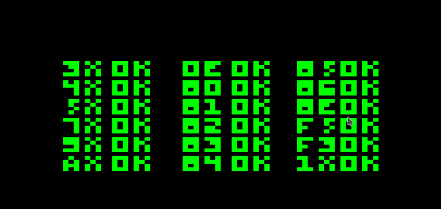
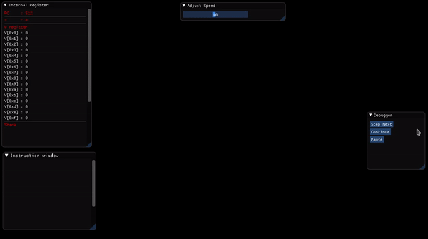

## What is CHIP8
CHIP-8 is an interpreted programming language, developed by Joseph Weisbecker. It was initially used on the COSMAC VIP and Telmac 1800 8-bit microcomputers in the mid-1970s. CHIP-8 programs are run on a CHIP-8 virtual machine. It was made to allow video games to be more easily programmed for these computers. (source [Wikipedia](https://en.wikipedia.org/wiki/CHIP-8))

## Why CHIP8
I recently got interested in emulation programming as I was always fascniated with the inner workings of a computer. The CHIP8 "emulator" is like the `Hello World!` program in writing emulators. I put double quotes around the word "emulator" because CHIP8 is an interpreted language but not actually a hardware by itself. Still, it is a worthwhile pursuit due to the similarities between the CHIP8 language and a system emulator. If you see the language, you can notice it resembles a lot like a assembly language.

## Status
As a first step, I tested my implementation of OPCODES with the test ROM from [here](https://github.com/corax89/chip8-test-rom). The results are shown below:
 

### Update
Emulator running PONG game with the debugger running on the side:

    

